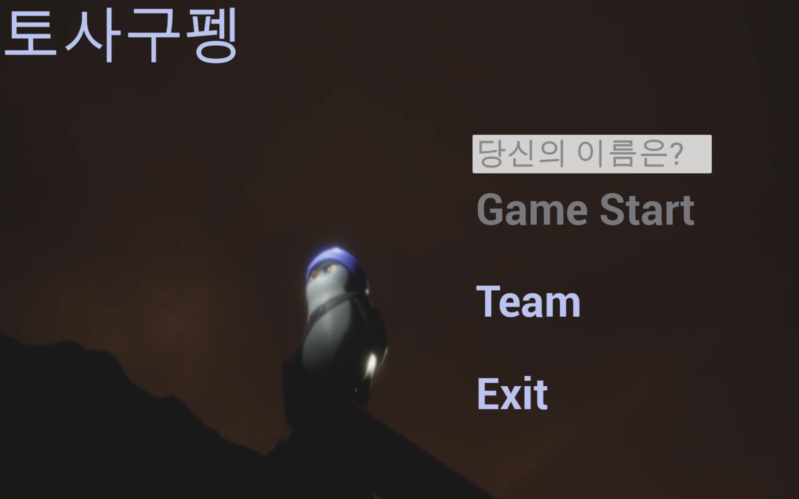
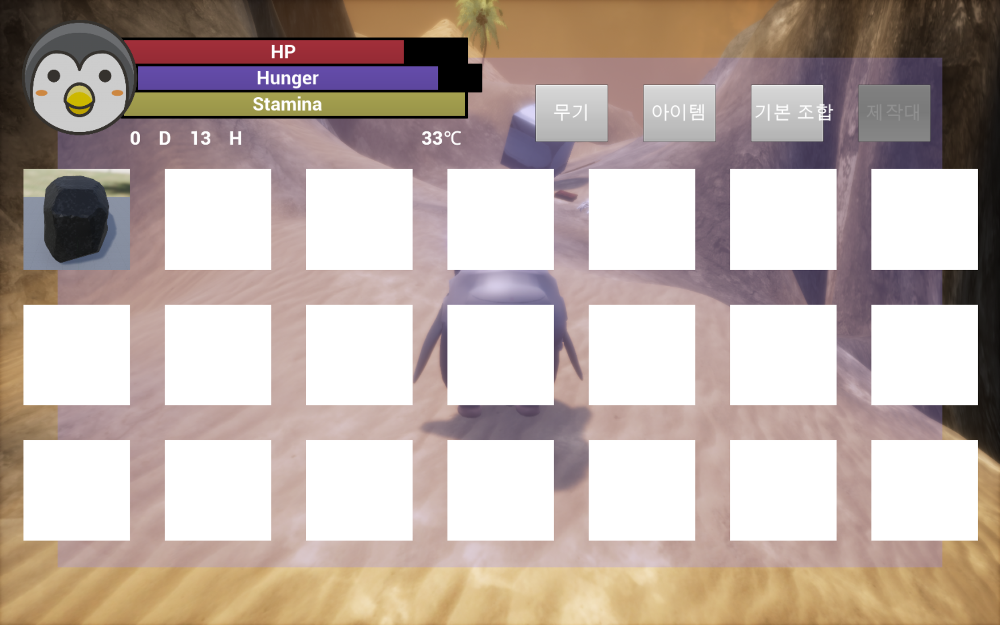

# PenguinSurvive_UE4

2021년 2학기 게임PX디자인 수업 Term Project

# Download
 - exe: https://drive.google.com/file/d/1ehUG6MrUz1Ain032-AYAvxACV54Tsop8/view?usp=sharing
 - source : https://drive.google.com/file/d/1QAaWiaSJ9NO8-qeoqKWD1cVJ56zQdCQO/view?usp=sharing

# Description
- 엔진 : UE 4.25.4 
- 협업 툴 : Perforce 
- 개발 언어 : C++(캐릭터,몬스터 로직), BluePrint(맵 기믹,UI) 
- 개발 기간:(21.10.15~21.12.20) 
- 게임 컨셉: 
    - 비행기를 타고 어딘가로 팔려가던 동물원 펭귄이 어떠한 사고로 사막에 떨어짐
    - 우연히도 펭귄만 생존
    - Hunger수치를 관리하며 사막에서 생존하면서 게임을 진행
    - 사막 어딘가에 떨어진 비행기 부품 5개를 조합해서 탈출하는 것이 최종 목표

# Team
- [윤태웅](https://github.com/yuntaewoong) 
- [강수한](https://github.com/tngksdlstk12) 
- [문석호](https://github.com/khumsh) 
- [서지혜](https://github.com/doro1129) 
- [이은화](https://github.com/eunhwa19)

 

